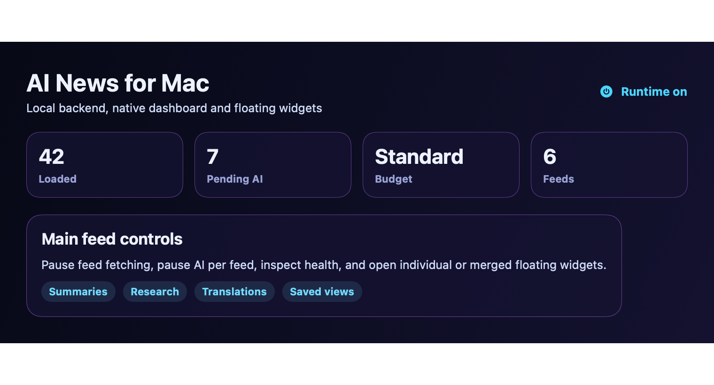

# AI News macOS Floating Widgets

AI News macOS Floating Widgets is a standalone macOS AI news product derived from `ai_news_deploy_ready`.

It ships as an installed macOS app that supervises its own local Node/Prisma backend, plus native floating widgets for individual feeds, merged feeds, and the filtered feed.

## Screenshots

The screenshots below show the companion dashboard and a live floating widget: scrolling the column view and stepping through stories in the stack view.



| Floating widget, column view | Floating widget, stack view |
| --- | --- |
|  |  |

## Structure

- `backend/` - local Node/Prisma API, RSS ingestion, AI jobs, filtered-feed matching, saved views, and widget endpoints.
- `native/` - SwiftUI companion app, floating widget windows, shared API client, theme system, and WidgetKit source.
- `scripts/` - app install/open helpers, backend build helpers, icon generation, and diagnostics.
- `docs/` - implementation notes and follow-up design docs.

## Main Features

- Local account login and local provider-key storage.
- Default feeds imported from the AI News project.
- Per-feed controls from the main page: turn feed fetching off/on and pause/resume AI.
- Filtered Feed as its own first-class feed driven by keyword rules.
- Fast keyword matching for filtered stories before slower semantic work finishes.
- AI actions for summaries, research, translations, neutral title rewrites, model/provider settings, usage totals, and budget/pending counts.
- Optional neutral-title filter for English and Bulgarian headlines, with global, per-feed, and per-category controls plus an on-demand story action.
- Story cards with images, summaries, research state, translation state, share action, save/pin actions, and source links.
- Sidebar health indicators showing loaded, pending, budget-blocked, hidden, and active feed state.
- Native floating widgets with:
  - individual feed widgets
  - filtered feed widget
  - merged feed widgets
  - column view
  - stack view
  - solid and transparent background modes
  - always-on-top behavior
  - per-widget size and position persistence
  - share button on each story
  - NEW label for unseen stack stories
  - stack navigation and stack load-more controls
- Drag-over merging for feed widgets, with title-chip unmerge.
- Saved Views page for saving, applying, editing, deleting, and rearranging widget layouts.
- Menu bar icon with quick app/widget actions.

## Install / Update

Run from the repo root:

```bash
cd /Users/donetianpetkov/ai_news/ai_news_mac_widget
npm install
npm run install:app
open "/Applications/AI News Widget.app"
```

The installed app starts and supervises its own backend. You normally do not need to run a backend command manually.

## Development Commands

```bash
npm run build:backend
npm run build:native
npm run install:app
npm run open:app
```

Useful backend-only commands:

```bash
npm run prisma:generate
npm run prisma:migrate
npm run start:backend
```

## AI Budget Plan

Neutral title rewriting is one extra AI request for each story that gets rewritten. The current prompt sends the source, original title, optional Bulgarian/English titles, summary, and RSS context, then asks for strict JSON. Budget estimate:

- About `250` AI tokens per neutralized story.
- About `2.5k` tokens for 10 stories.
- About `25k` tokens for 100 stories.
- About `250k` tokens for 1,000 stories.

Budget behavior:

- `Low` - neutral titles are manual only.
- `Standard` - neutral titles run for visible/on-demand stories only.
- `High` - neutral titles also run in the background for newly fetched stories and backfills.

## Runtime Files And Logs

- Runtime backend URL: `/tmp/ai-news-mac-widget-runtime.json`
- Backend log: `~/Library/Logs/AINewsMacWidget/backend.log`
- App/widget debug log: `/tmp/ai-news-widget-debug.log`
- Local app data: `~/Library/Application Support/AINewsMacWidget/`

Health checks:

```bash
curl -s http://127.0.0.1:3000/api/health
curl -s http://127.0.0.1:3000/api/categories
```

## Diagnostics And Visual Verification

Before changing code for a reported bug, generate an evidence pack:

```bash
npm run diagnose:quick
```

For widget layout, window size, mode switching, stale UI, or icon problems:

```bash
npm run diagnose:visual
```

The diagnostic pack is written under `diagnostics/` and includes `REPORT.md`, command logs, backend/widget log tails, runtime config, API probes, AI queue probes, and optional desktop/window screenshots. See `docs/diagnostics.md` for the full runbook.

## Operational Notes

- The app follows the backend runtime file when the backend port changes.
- If the app reports a backend/network error, check the runtime file and backend log first.
- Feed refresh now reloads the selected stories and resets the main list to the newest story instead of preserving a stale deep scroll offset.
- API request failures are logged with method, path, and URL so cancellation/timeout/connectivity errors are diagnosable.
- Hidden categories are presentation-level visibility; use feed controls to stop fetching or pause AI.
- Images are supported in the companion app and floating widgets when enabled.
