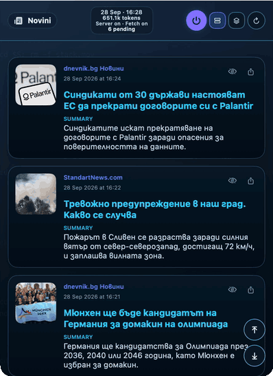
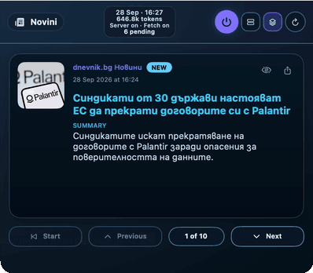

# AI News macOS Floating Widgets

A standalone macOS app that collects news from RSS feeds, adds AI summaries, research, and translations, and shows the stories in floating widgets that stay on top of your other windows. Everything runs locally: the app starts its own backend, and your account and AI provider keys stay on your Mac.

| Floating widget, column view | Floating widget, stack view |
| --- | --- |
|  |  |

## Features

- Floating widgets that stay on top of other windows, for one feed, several merged feeds, or a keyword-filtered feed.
- Column view for scrolling and stack view for stepping through stories one at a time, with NEW labels on unseen stories.
- Drag one widget onto another to merge them, and save widget layouts as views.
- AI summaries, research, translations, and optional neutral headlines in English and Bulgarian.
- Per-feed controls to pause fetching or AI, plus feed health and AI budget settings.
- Local account and AI provider keys that never leave your Mac.
- Menu bar icon for quick actions.

The full feature list and AI budget notes are in [docs/features.md](docs/features.md).

## Install

You need macOS, Node.js, and Xcode (the full app, because the build uses `xcodebuild`). From the repo root:

```bash
npm install
npm run install:app
open "/Applications/AI News Widget.app"
```

Then create a local account in the app and add an AI provider key in Settings & AI. Run the same install command again to update.

## More Documentation

- [Development and operations](docs/development.md): build commands, logs, health checks, and troubleshooting.
- [Diagnostics runbook](docs/diagnostics.md): evidence packs for bug reports.
- [Windows plan](docs/windows-native-plan.md) and [Android plan](docs/android-native-plan.md): how to re-create the app on other platforms.
